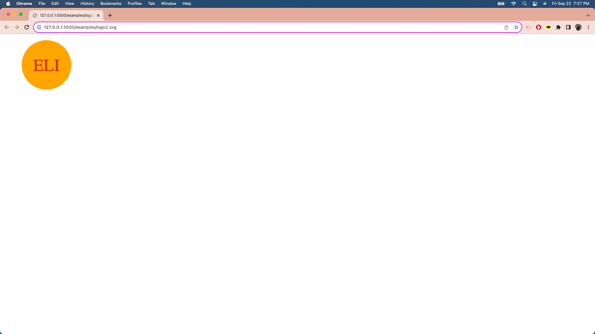
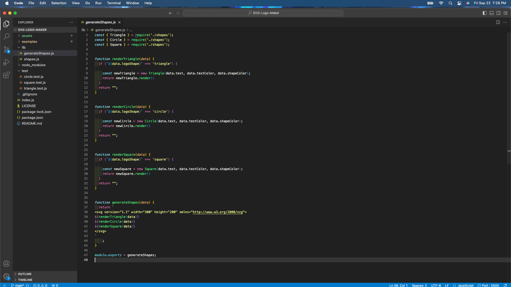
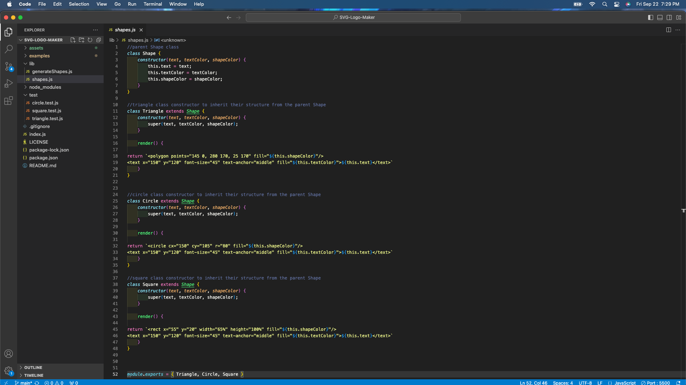
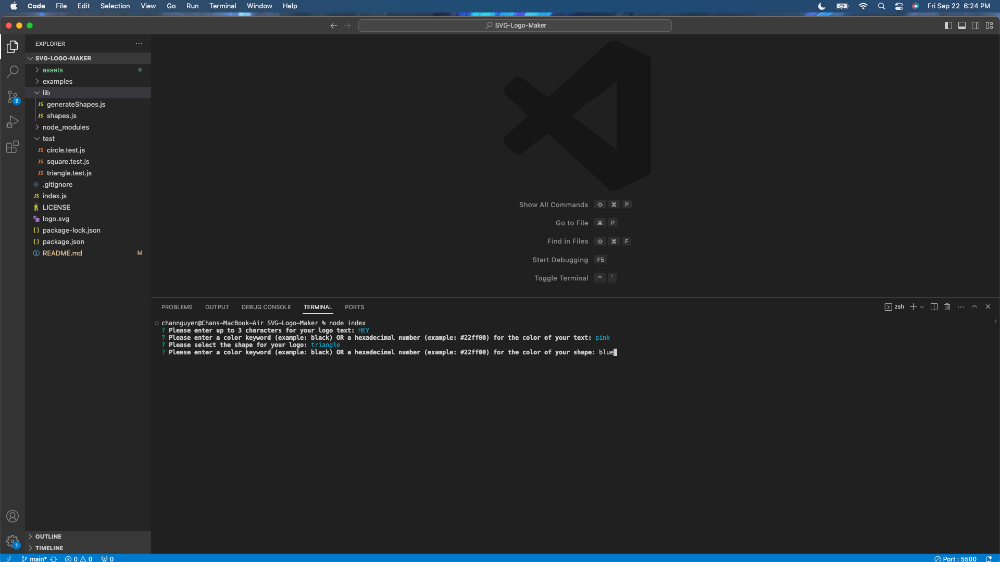
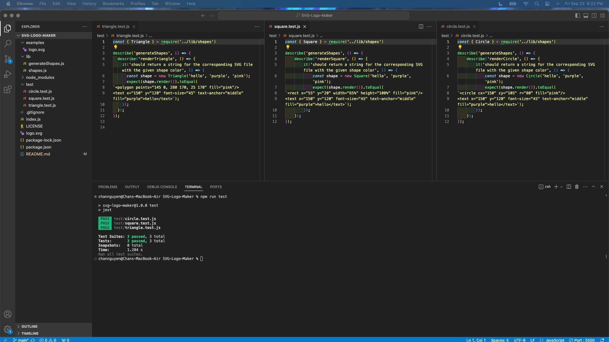

# SVG-Logo-Maker

## Table of Contents
- [Description](#description)
- [Installation](#installation)
- [Usage](#usage)
- [License](#license)
- [Contribution](#contribution)
- [Tests](#tests)
- [Questions](#questions)

## Description
The purpose of creating a SVG-Logo-Maker through the command line in the terminal is so that the user does not have to pay for a third party to create one. The user can create a custom logo efficiently by opening the terminal, answering a series of questions, and once complete, the SVG logo is dynamically created from the user’s responses.
View a video of the SVG-Logo-Maker executed in the terminal command line here: https://drive.google.com/file/d/11ucVJ_H6YB__Z2JaV7fEVycDW42qogs3/view?usp=sharing.
View a video of the user tests here: https://drive.google.com/file/d/1nrUxqSJvNh7oY5fKZ4n_xhfOoZVYRaac/view?usp=sharing. 

## Installation
VS Code for JavaScript. GibHub for version control. Jest needs to be installed to run a user test on the code, with the download instructions found here: https://www.npmjs.com/package/jest. The npm inquirer@8.2.4 also needs to be installed. The link can be found here: https://www.npmjs.com/package/inquirer/v/8.2.4.

## Usage
This can be used when users want to create their own custom logo for projects.
See a sample of the logo:

View a screenshot of the generateShapes.js file in VS Code::

View a screenshot of the class constructors in VS Code:

View a screenshot of the user tests in VS Code:

View a screenshot of the imports, inquirer questions, writetoFile and init functions in VS Code:

## License
This project is under the MIT license.

## Contribution
The coding (module imports, module exports, inquirer questions array, writeFile method, init function, class constructors with inheritance, render functions, user tests, and conditional statements) -all the additions- are credited to the curriculum taught in the UCI coding boot camp and are credited to the instructor in the UCI coding boot camp. A tutor from the UCI coding boot camp also helped provide guidance on restructuring the class constructors, the render functions, and the user tests.
Information to download the inquirer package and on how to structure the prompt can be found here: https://www.npmjs.com/package/inquirer/v/8.2.4.
Information to download the Jest package can be found here: https://www.npmjs.com/package/jest.
How I designed the circle and square shapes are credited to this resource: https://developer.mozilla.org/en-US/docs/Web/SVG/Tutorial/Basic_Shapes.
How I designed the triangle shape is from this resource: https://thenewcode.com/1037/SVG-Shape-Elements-Polygons.
How I edited the text of the logo can be found in this resource: https://developer.mozilla.org/en-US/docs/Web/SVG/Tutorial/Texts.
How I started forming the logo’s syntax in my code is through this resource: https://developer.mozilla.org/en-US/docs/Web/SVG/Tutorial/Getting_Started.
To complete the README with screenshots, the source for the code is: https://stackoverflow.com/questions/10189356/how-to-add-screenshot-to-readmes-in-github-repository.
To complete the README section, the source is: https://coding-boot-camp.github.io/full-stack/github/professional-readme-guide.
To complete the markdown for the README, the source is: https://www.markdownguide.org/basic-syntax/.
https://gist.github.com/lukas-h/2a5d00690736b4c3a7ba.

## Tests
To test this SVG-Logo generator, make sure that the appropriate installations (inquirer and Jest) have been completed, and run “npm install” when in VS Code as well. Users can clone this repo, navigate to the terminal command line of this repo, and test typing "node index" in the terminal command line. Answer the series of questions by inputting the following: a random shape color, a random text color, up to 3 characters. Also, select a shape from the list. Upon answering all questions, a new logo.svg file will be created in your VS code of the repo, or, if you have an existing logo.svg, what the user inputted will overwrite what was on the logo.svg file previously. See the screenshot below:

Users can also run tests by navigating to the terminal command line of this repo and typing “npm run test”. The tests will indicate that they have passed, promising that the logos will generate as stated. See the screenshot below:

## Questions
The link to my Github Profile here: https://github.com/codeandlift706.
For any additional questions, please reach me at: channguyen715@gmail.com.
